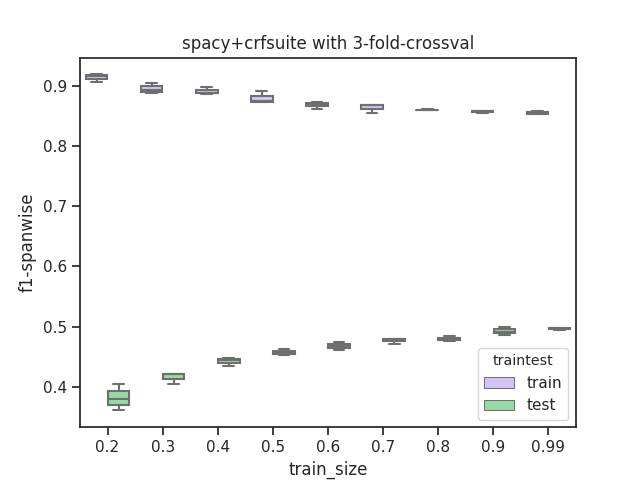

# sequence-tagging
### setup
    pip install -r requirements
    
### download scierc-data
    python -c "from util.data_io import download_data; download_data('http://nlp.cs.washington.edu/sciIE/data','sciERC_processed.tar.gz','data',unzip_it=True)"

### calc+plot learning curve
* in steps of 10% increasing subset of train-set to 0.99%
* testset is fixed, not changed at all

