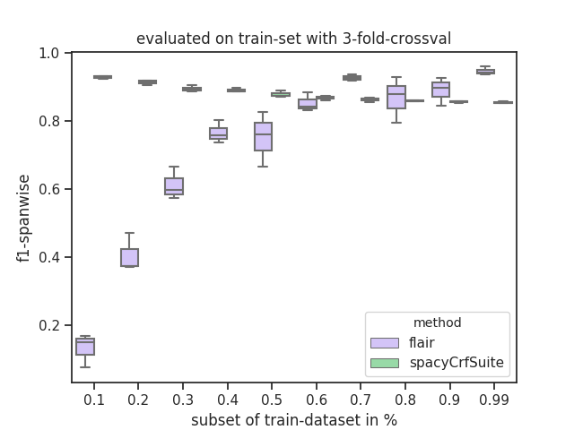
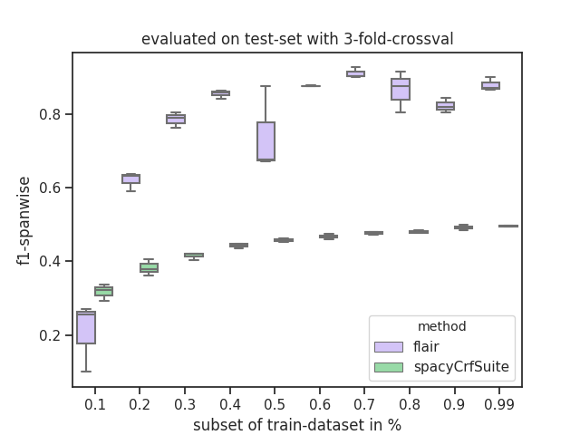

# sequence-tagging
### setup
    pip install -r requirements
    
### download scierc-data
    python -c "from util.data_io import download_data; download_data('http://nlp.cs.washington.edu/sciIE/data','sciERC_processed.tar.gz','data',unzip_it=True)"

### calc+plot learning curve
* testset is fixed, not changed at all

        got 30 evaluations to calculate 
        calculating learning-curve for spacyCrfSuite took 161.36 seconds
        calculating learning-curve for flair took 1578.75 seconds
        
#### learning-curve evaluated on train-set

#### learning-curve evaluated on train-set

* why is crf-suite so bad and flair so good?
