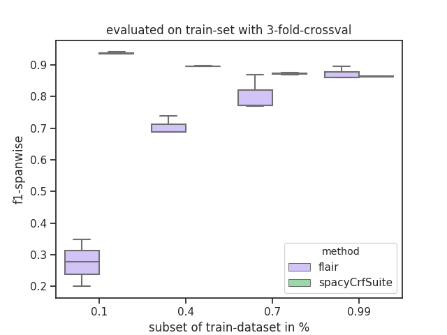
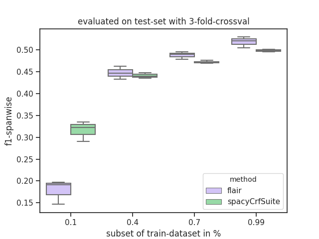
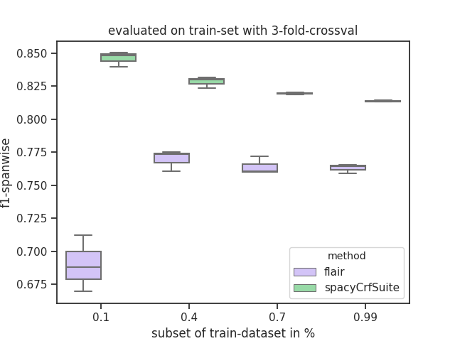
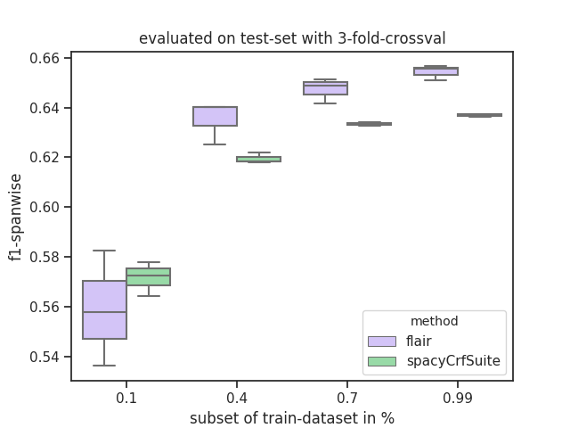
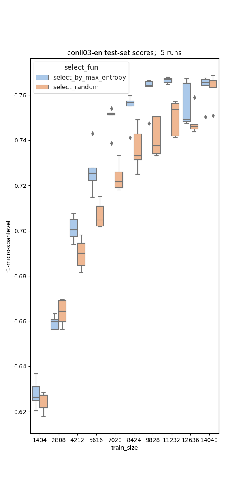
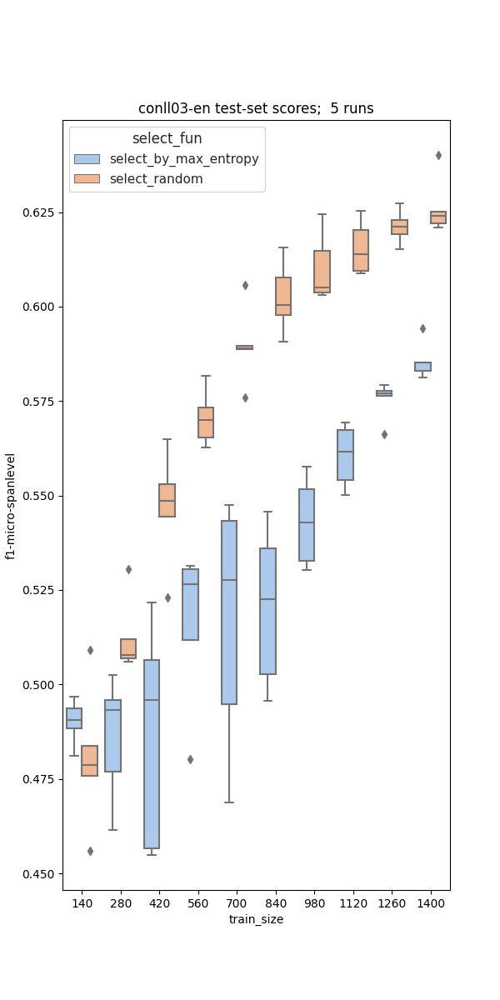

# sequence-tagging

one sentence from JNLPBA-dataset visualized with [doccano](https://github.com/doccano/doccano.git)
### setup
    pip install -r requirements
    python -m spacy download en_core_web_sm
    
### data

#### scierc-data
    python -c "from util.data_io import download_data; download_data('http://nlp.cs.washington.edu/sciIE/data','sciERC_processed.tar.gz','data',unzip_it=True)"

#### JNLPBA
    git clone https://github.com/allenai/scibert.git
see `scibert/data/ner/JNLPBA`   

### learning-curve on scierc-data





### learning-curves on JNLPBA-data




# active learning curves 
## uncertainty sampling vs. random sampling
* sequence-tagger: spacy-features + crfsuite
* 5 times 10 "steps"

### steps of 10% of trainset-size 

### steps of 1% of trainset-size 


## result
* entropy/uncertainty -based sampling seems not beneficial if model is dumb (too few traindata or too shallow?)


# 3fold shuffle split on JNLPBA-dataset
* 20% of train-data, evaluated on test-set (which is not splitted)

* why is farm so bad? where is the bug?

# sequence tagging [transformers + lightning](https://github.com/huggingface/transformers/blob/master/examples/token-classification/run_pl_ner.py)

### setup on HPC
0. `pip install -r requirements.txt`
1. `OMP_NUM_THREADS=8 bash download_data.sh`
2. `python preprocess.py --model_name_or_path bert-base-multilingual-cased --max_seq_length 128`
3. `export PYTHONPATH="../":"${PYTHONPATH}"`
4. to download pretrained model: `OMP_NUM_THREADS=8 python3 run_pl_ner.py --data_dir ./ --labels ./labels.txt --model_name_or_path $BERT_MODEL --do_train`
### train & evaluate

```shell script
python3 run_pl_ner.py --data_dir ./ \
--labels ./labels.txt \
--model_name_or_path bert-base-multilingual-cased  \
--output_dir checkpoints \
--max_seq_length  128 \
--num_train_epochs 3 \
--train_batch_size 32 \
--seed 1 \
--do_train \
--do_predict
```
after 3 epochs in ~20 minutes: 
```shell script
TEST RESULTS
{'avg_test_loss': tensor(0.0733),
 'f1': 0.8625160051216388,
 'precision': 0.8529597974042419,
 'recall': 0.8722887665911299,
 'val_loss': tensor(0.0733)}

``` 