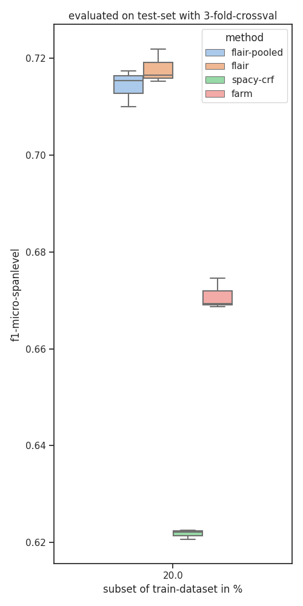

# sequence-tagging
### setup
    pip install -r requirements
    python -m spacy download en_core_web_sm
    
### data

#### scierc-data
    python -c "from util.data_io import download_data; download_data('http://nlp.cs.washington.edu/sciIE/data','sciERC_processed.tar.gz','data',unzip_it=True)"

#### JNLPBA
    git clone https://github.com/allenai/scibert.git
see `scibert/data/ner/JNLPBA`   

### learning-curve on scierc-data

### learning-curves on JNLPBA-data

# active learning curves 
## uncertainty sampling vs. random sampling
* sequence-tagger: spacy-features + crfsuite
* 5 times 10 "steps"

### steps of 10% of trainset-size 

### steps of 1% of trainset-size 

## result
* entropy/uncertainty -based sampling seems not beneficial if model is dumb (too few traindata or too shallow?)

# 3fold shuffle split on JNLPBA-dataset
* 20% of train-data, evaluated on test-set (which is not splitted)

* why is farm so bad? where is the bug?